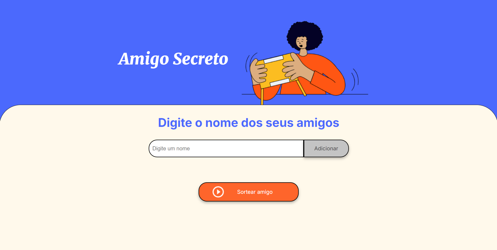

# Amigo-Secreto-ONE

Neste Challenge do curso ONE nos foi proposto a desenvolver um programa para sortear amigos, ou seja, você adiciona os amigos e após adicionar todos eles você só precisa clicar em sortear amigo, assim aparecendo o amigo sorteado. 



**<h3 style="font-family: Arial; font-size: 20px;">Código</h3>**

Primeiramente foi pedido para criar um array, onde ele amazenerá os amigos adicionados

```js
let amigos = [];
```

**<h3 style="font-family: Arial; font-size: 15px;">FUNÇÃO: `adicionarAmigo`</h3>**

```js
function adicionarAmigo(){
    let nome = document.getElementById('amigo').value;
    if(nome == null){
        alert('Digite o nome de um amigo');
    }else{
        amigos.push(nome);
        atualizarLista(nome);
        limparCampo();
    }
}
```

Nela nós verificamos se o input tem valor nulo, caso ele tenha da um alerta pro usuário pedindo que ele digite o nome de um amigo, senão ele adiciona o amigo na lista e chama mais duas funções `atualizarLista()` e `limparCampo()` que serão explicadas mais a frente. 


**<h3 style="font-family: Arial; font-size: 15px;">FUNÇÃO: `atualizarLista`</h3>**

```js
function atualizarLista(nome){
    // participantes.forEach(element => {
    //     let bullet = document.createElement('li');
    //     bullet.appendChild(element);
    //     lista.appendChild(bullet);
    // });
    let bullet = document.createElement('li');
    let texto = document.createTextNode(nome);
    bullet.appendChild(texto);
    for(let i = 0; i < amigos.length; i++){
        lista.appendChild(bullet);
    }
}
```

Nessa função nós criamos um novo elemento `li` e adicionamos o nome adicionado nele, após isso fizemos um loop `for` que continua até o tamanho do array `amigos`. No loop nós adicionamos o elemento `li` na varável lista `let lista = document.getElementById('listaAmigos');` que seria o nosso `ul`.

**<h3 style="font-family: Arial; font-size: 15px;">FUNÇÃO: `limparCampo`</h3>**

```js
function limparCampo() {
    let nome = document.getElementById('amigo');
    nome.value = '';
}
```

A função limparCampo como o próprio nome diz serve para limpar o campo, neste caso limpamos o campo onde adicionamos o nome. Primeiramente criamos a variável nome que armazena o input, logo em seguida colocamos o valor dele como uma string vazia.

Agora a função que faz o papel principal do nosso código a função de sortear o amigo. 

```js
function sortearAmigo(){
    if(amigos.length == 0 || amigos.length == 1){
        alert("Adicione pelo menos 2 amigos para jogar");
    }else{
        let resultado = document.getElementById('resultado')
        lista.innerHTML = "";
        resultado.innerHTML = `Seu amigo secreto é ${amigos[Math.floor(Math.random() * amigos.length)]}`;
    }
}
```

Na função a primeira coisa que fazemos é checar se o tamanho do array que armazena os amigos é igual a 0 ou igual a 1, caso seja ele da um alerta para adicionarmos pelo menos dois amigos, senão ele cria a variável resultado que armazena o `ul`, deixa a lista de amigos com uma string vazia e joga no `ul` o nome do amigo secreto utilizando o seguinte código:

```js
resultado.innerHTML = `Seu amigo secreto é ${amigos[Math.floor(Math.random() * amigos.length)]}`;
```
Que sorteia um index aleatória do array amigos e adiciona em resultado.
